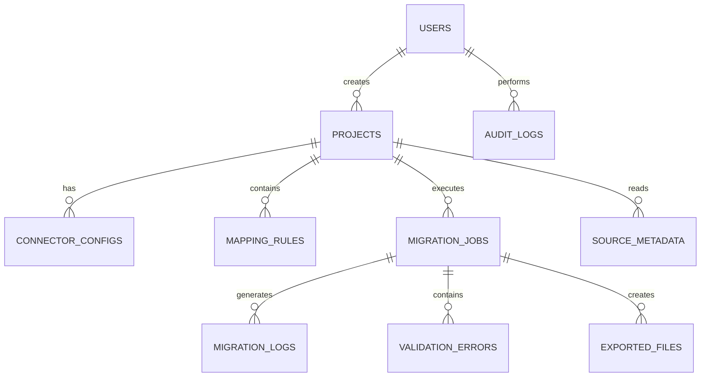

# ERP Bridge
## Entity Relationship Diagram

Version: 1.0

---

# Mermaid ER Diagram

---

# Relationship Summary

One User

↓

Many Projects

One Project

↓

Many Migration Jobs

One Migration Job

↓

Many Logs

One Project

↓

Many Mapping Rules

One Project

↓

Many Connector Configurations

One Migration Job

↓

Many Validation Errors

One Migration Job

↓

Many Exported Files